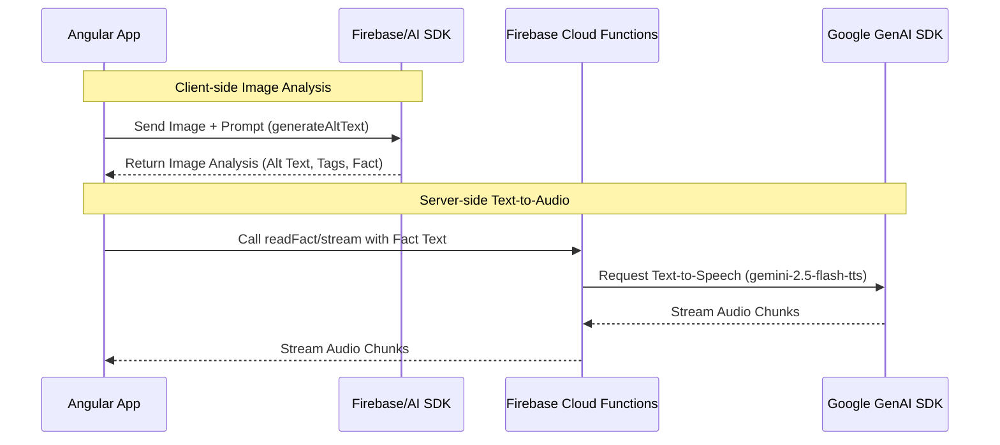

# Firebase AI Hybrid Demo

This project demonstrates a hybrid approach to integrating AI features into an Angular application using Firebase. It utilizes client-side AI processing for image analysis and server-side processing via Firebase Cloud Functions for text-to-audio streaming.

## Technical Stack

* **Frontend:** Angular v21, Tailwind CSS v4
* **Backend:** Firebase Cloud Functions (Node.js)
* **AI SDKs:**
  * Client: `firebase/ai` (Gemini API for Web)
  * Server: `@google/genai` (Google Gen AI SDK for Node.js)
* **Infrastructure:** Firebase Hosting, Firebase Local Emulator Suite

## Architecture

The following diagram illustrates the data flow between the Angular client, Firebase services, and the Gemini models:



## Local Development Setup

To run this project locally, you need to set up both the Firebase Emulators and the Angular development server.

### Prerequisites

* Node.js (v24 recommended, as specified in functions, which supports `process.loadEnvFile()`)
* [Firebase CLI](https://firebase.google.com/docs/cli) installed globally (`npm install -g firebase-tools`)
* Log in to Firebase using the CLI:

    ```bash
    firebase login
    ```

### 1. Firebase Setup

First, configure and start the Firebase Cloud Functions emulator.

1. **Create a Firebase Project:** If you don't already have a project, go to the [Firebase Console](https://console.firebase.google.com/), create a new project, and **enable Vertex AI** for that project.
2. Navigate to the functions directory:

    ```bash
    cd firebase-project/functions
    ```

3. Install dependencies:

    ```bash
    npm install
    ```

4. Create your environment file by copying the example:

    ```bash
    cp .env.example .env
    ```

5. Open the newly created `.env` file and update the configuration with your project details using placeholders:

    ```env
    APP_API_KEY="<YOUR_FIREBASE_API_KEY>"
    APP_MESSAGING_SENDER_ID="<YOUR_SENDER_ID>"
    APP_ID="<YOUR_APP_ID>"
    RECAPTCHA_ENTERPRISE_SITE_KEY="<YOUR_RECAPTCHA_KEY>"
    # Keep the other defaults provided in .env.example
    ```

6. Start the Firebase Local Emulator Suite:

    ```bash
    npm run serve
    ```

### 2. Angular Setup

In a new terminal window, start the Angular development server.

1. Navigate to the root project directory:

    ```bash
    cd /path/to/firebase-ai-hybrid-demo
    ```

2. Install dependencies:

    ```bash
    npm install
    ```

3. Start the application:

    ```bash
    npm run start
    ```

Once the server is running, open your browser and navigate to `http://localhost:4200/`.
